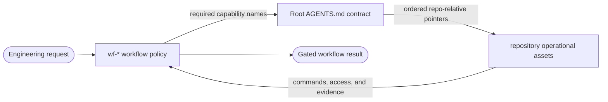
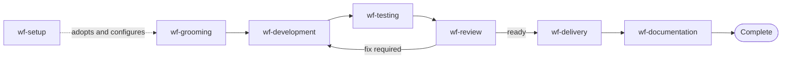
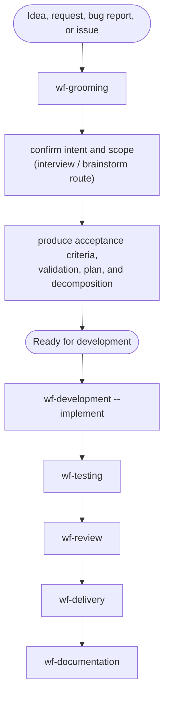
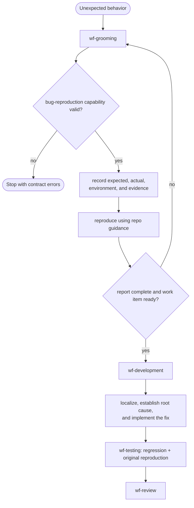
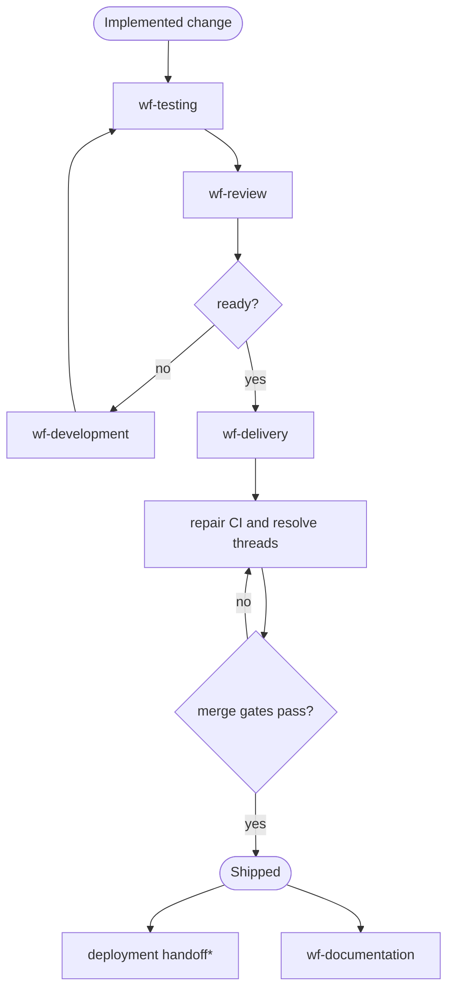
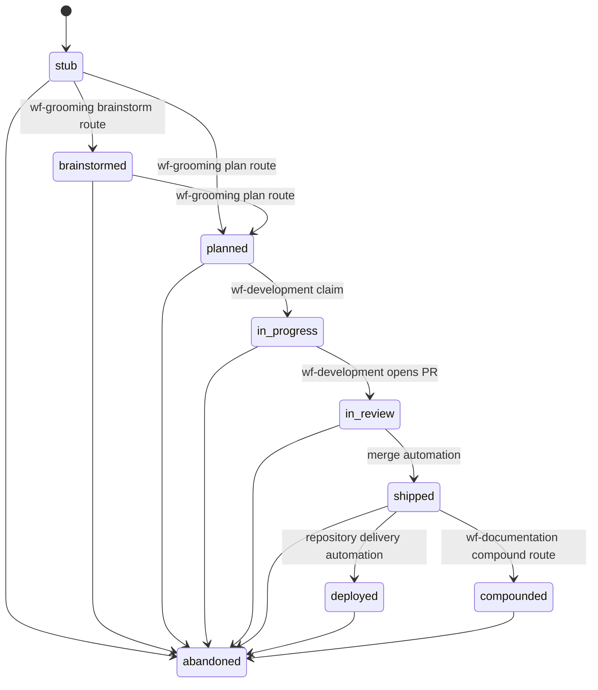
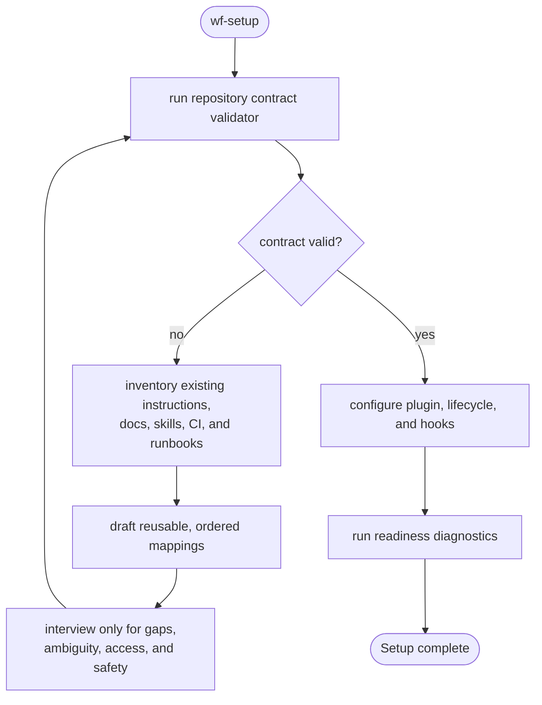

# Workflow flows

Visual reference for the seven public `wf-*` skills and their repository-context handoffs. The detailed procedures shown in parentheses are internal references selected by a router; they are not independently invocable skills.

## The two orthogonal layers

- `wf-*` decides **what must happen, in what order, and what counts as complete**.
- Root `AGENTS.md` maps each fixed capability name to one or more repository-owned assets in primary-first reading order.
- Repository-owned guidance decides **how this repository performs the operation**. Its skill names are unconstrained.

Missing or malformed repository context stops every ordinary workflow. `wf-setup` may continue only to repair that context. See [WORKFLOW_SKILLS.md](WORKFLOW_SKILLS.md) for the complete contract.

## Public workflow map

`wf-development` can coordinate the complete chain for a prepared work item. Ownership does not collapse during orchestration: each downstream router still owns its own gates and repository-capability requirements.

## Grooming and implementation split

The hard boundary is deliberate: `wf-grooming` never claims work or edits product code. `wf-development --implement` refuses to invent missing grooming context and routes back to `wf-grooming`.

## Bug flow

A failed reproduction blocks grooming; it is evidence to report, not permission to plan a speculative fix. Production or integration failures additionally require the `observability` capability.

## Delivery flow

`*` Deployment requires `infrastructure-operations` and `security-and-access` in addition to the base `delivery` capability.

## Lifecycle state machine

In `github-project` mode, workflow routes write a closed set of lifecycle transitions through `scripts/lifecycle_board.py`.

`deployed` and `compounded` are order-independent refinements of `shipped`. `abandoned` is the explicit off-ramp. The lifecycle reference under `wf-setup` defines entry gates, writer contracts, claims, and the closed repair set.

## Setup flow

`wf-setup` is the only router allowed to continue temporarily after contract validation fails, and only to construct, migrate, or repair the contract. It maps suitable existing assets directly, never creates wrappers merely for naming or metadata, never guesses operational guidance, and cannot finish until strict validation succeeds.

## Progressive disclosure

Each router follows the same sequence:

1. Validate the complete repository contract.
2. Require the capabilities needed by the selected route.
3. Read each capability's primary target, then supporting targets only as needed.
4. Load only the internal procedure needed for the current stage.
5. Return to the router for its handoff and completion gate.

This keeps workflow policy stable across repositories while allowing every repository to supply its own commands, infrastructure, access procedures, and evidence sources.
