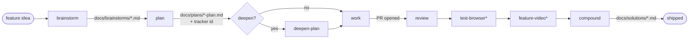
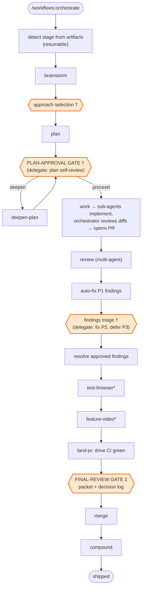
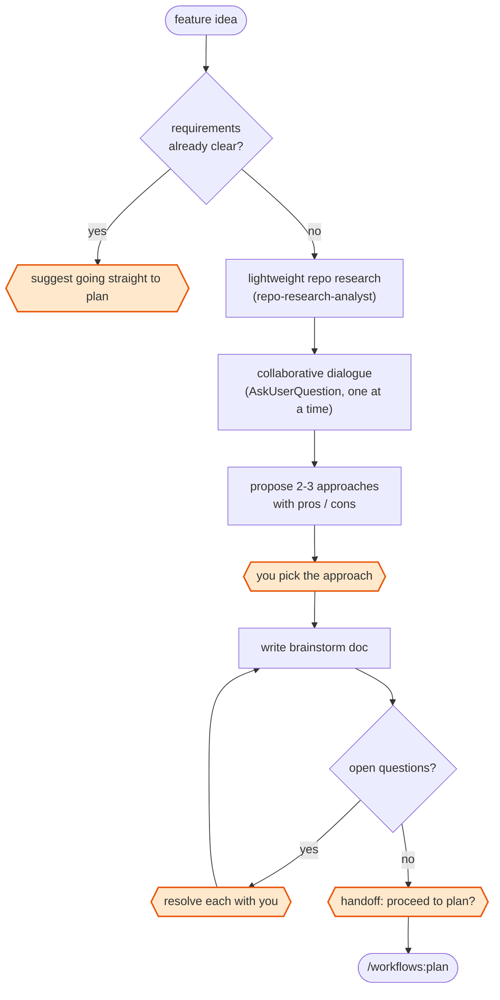
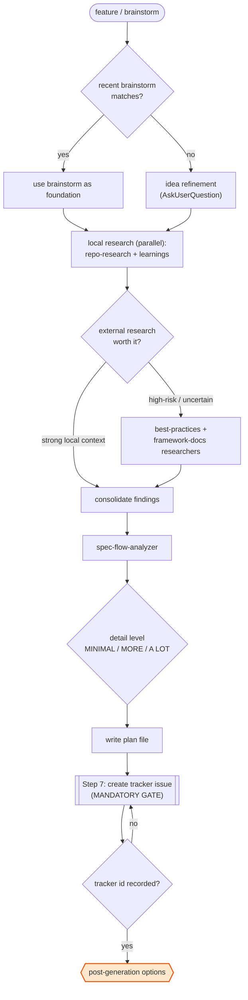
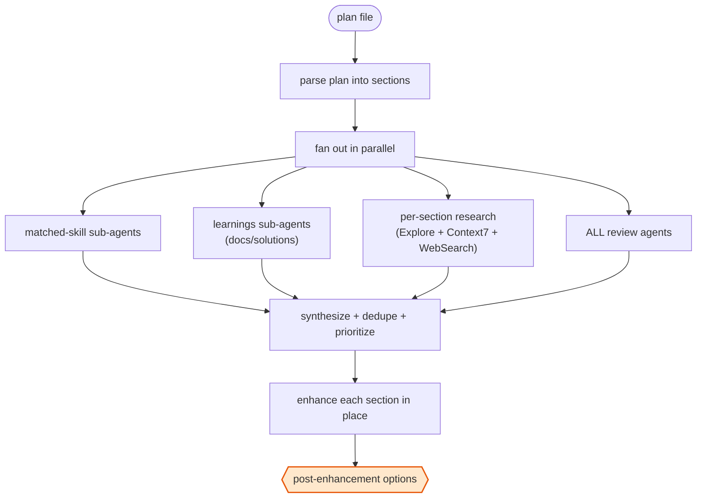
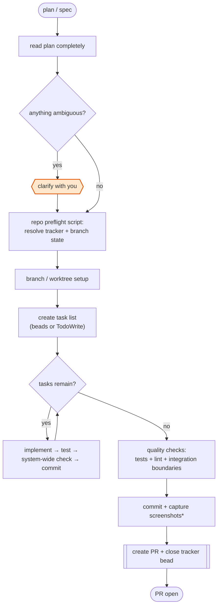
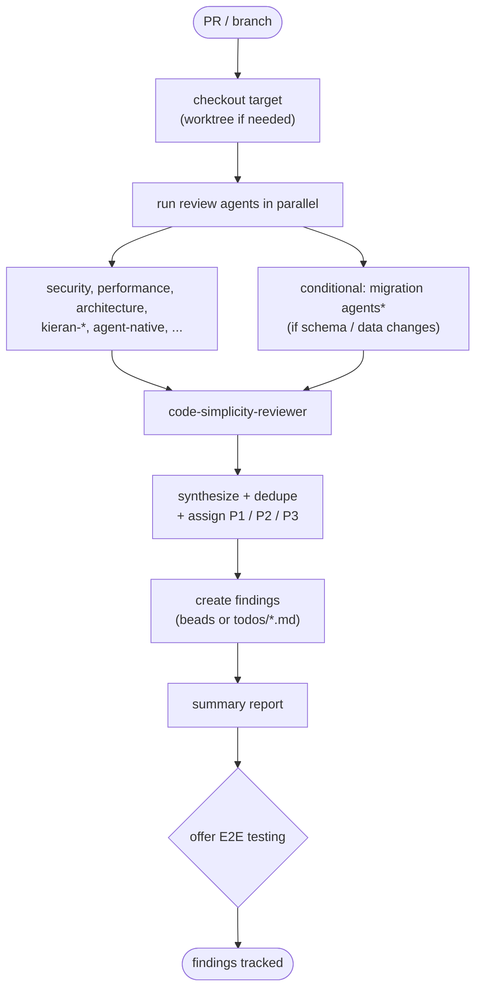
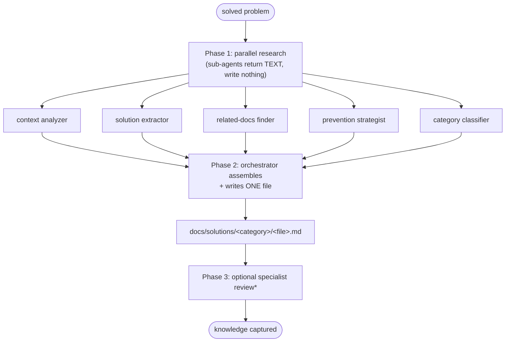
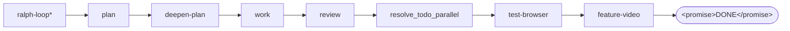
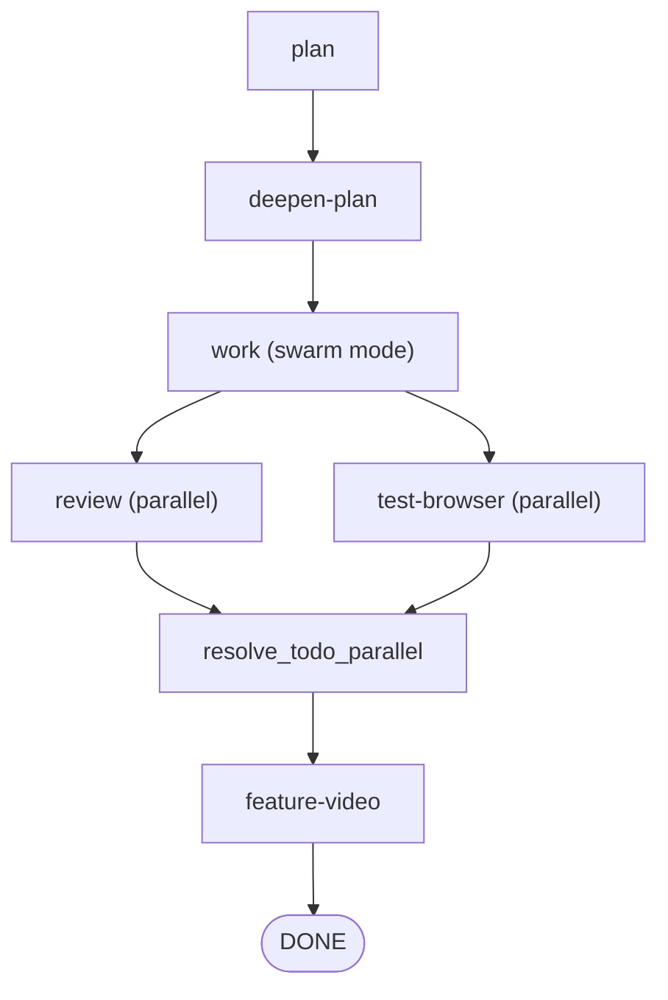

# Workflow Flows

Visual reference for the plugin's engineering pipeline. Each "flow" below is a slash command; together they form the compounding-engineering loop. Diagrams render natively on GitHub.

## Legend

The same shape language is used in every diagram:

| Shape | Meaning |
|-------|---------|
| `([ rounded ])` | Start / end of a flow |
| `[ rectangle ]` | Automatic step (no user input needed) |
| `{ diamond }` | Automatic decision (the agent decides) |
| `{{ hexagon }}` | **Human checkpoint** — your input / steering |
| `[[ subroutine ]]` | Mandatory gate or a delegated sub-command |

`*` on a node = runs **only when applicable** (e.g. UI changes only).

---

## The big picture

How the individual flows compose into one pipeline, with the artifact each stage leaves behind (these artifacts are what makes the pipeline resumable):

`/workflows:orchestrate` runs this whole chain for you. `/lfg` and `/slfg` run it fully autonomously.

---

## /workflows:orchestrate — the orchestrator layer

The orchestrator drives every stage automatically. In the default **delegate** mode it delegates implementation to sub-agents, reviews their diffs itself, self-answers the intermediate gates (logging every decision), and stops at exactly one hexagon — the **Final-Review gate** — plus genuine blockers. `--steer` restores the classic cadence where every hexagon below pauses for you.

† pauses for you in `--steer`/`--careful`; in delegate mode the orchestrator self-answers and logs the decision.
‡ delegate mode's single gate; the `--auto` modifier collapses it (auto-merge once landable, packet becomes the final summary).

**Autonomy dial:** `--careful` > `--steer` > *delegate (default)*; `--auto` is not a fourth mode but a modifier on delegate that toggles only the Final-Review gate. Blockers and material scope changes escalate in **every** mode. In delegate mode, the optional `ralph-wiggum` loop keeps the run moving — but surviving gates still pause it, exactly like `/goal`.

---

## /workflows:brainstorm — decide WHAT to build

---

## /workflows:plan — decide HOW to build it

Tracker-issue creation (Step 7) is a hard gate enforced by the `plan-tracker-guard` Stop hook: the plan cannot exit without a `bead_id` / `github_issue` (or an explicit `issue_tracker: none`).

---

## /deepen-plan — enrich the plan with parallel research

Fans out one sub-agent per matched skill, per relevant learning, per plan section, and per discovered review agent — then merges everything back into the plan in place.

---

## /workflows:work — execute the plan and ship a PR

Tracker-aware (beads / GitHub / none) and supports three execution styles: **inline** (default), **orchestrated** (one sub-agent per bead), and **swarm** (parallel teammates).

---

## /workflows:review — multi-agent code review

Runs configured review agents in parallel (plus conditional migration agents), synthesizes findings into P1/P2/P3, and records them tracker-aware (beads or `todos/*.md`). P1 findings block merge.

---

## /workflows:compound — capture the solution

Phase-1 sub-agents return **text only**; only the orchestrator (Phase 2) writes a single file. Knowledge compounds: the next occurrence of this problem is a lookup, not a re-investigation.

---

## /lfg and /slfg — fully autonomous (no human in the loop)

`/lfg` runs the pipeline end to end without stopping. `/slfg` is the same, but runs work in swarm mode and review + test-browser in parallel.

`/workflows:orchestrate` sits between these two extremes: it runs the same operations as `/lfg`, but pauses at the human checkpoints shown in the orchestrate diagram above.
