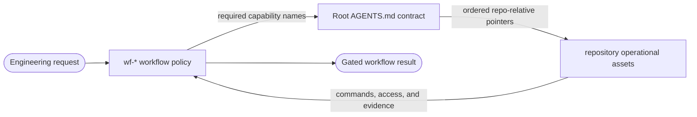
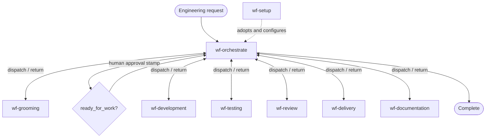
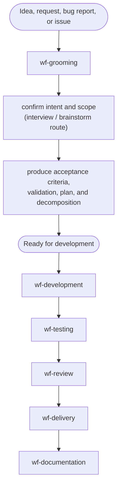
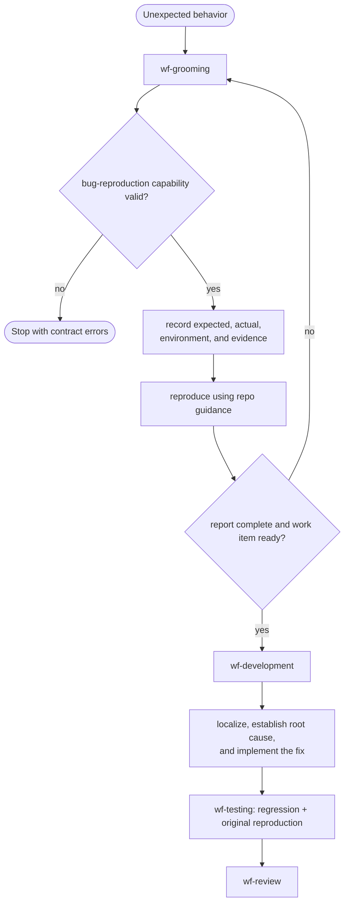
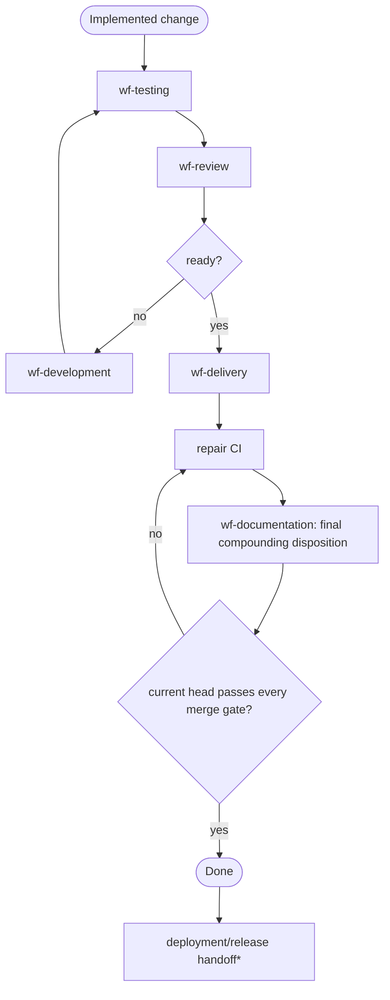
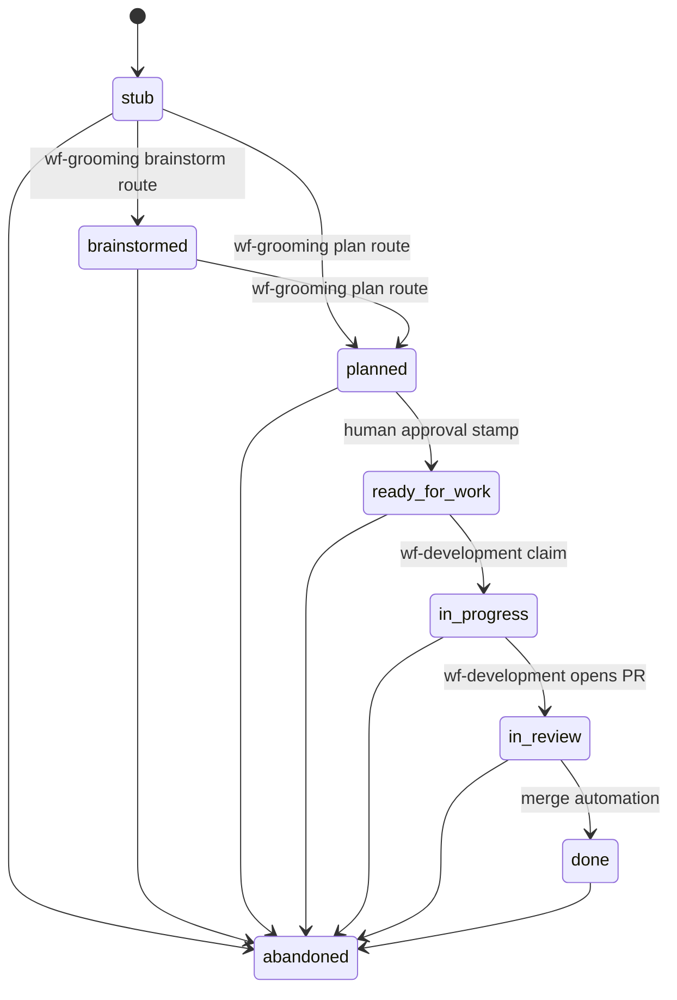
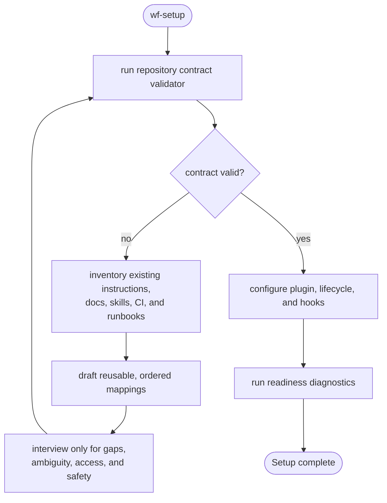

# Workflow flows

Visual reference for the eight public `wf-*` skills and their repository-context handoffs. The detailed procedures shown in parentheses are internal references selected by a router; they are not independently invocable skills.

## The two orthogonal layers

```mermaid
flowchart LR
    request([Engineering request]) --> WF["wf-* workflow policy"]
    WF -->|"required capability names"| C["Root AGENTS.md contract"]
    C -->|"ordered repo-relative pointers"| R["repository operational assets"]
    R -->|"commands, access, and evidence"| WF
    WF --> result([Gated workflow result])
```

See [WORKFLOW_SKILLS.md](WORKFLOW_SKILLS.md) for the layer model and the complete contract.

## Public workflow map

Delegation is vertical — [WORKFLOW_SKILLS.md](WORKFLOW_SKILLS.md) owns the model.

```mermaid
flowchart TD
    req([Engineering request]) --> O["wf-orchestrate"]
    O <-->|"dispatch / return"| G["wf-grooming"]
    O -->|"human approval stamp"| approve{"ready_for_work?"}
    approve --> O
    O <-->|"dispatch / return"| D["wf-development"]
    O <-->|"dispatch / return"| T["wf-testing"]
    O <-->|"dispatch / return"| R["wf-review"]
    O <-->|"dispatch / return"| L["wf-delivery"]
    O <-->|"dispatch / return"| K["wf-documentation"]
    O --> done([Complete])
    S["wf-setup"] -. "adopts and configures" .-> O
```

The stage order is grooming → approval → development → testing → review → delivery, with the knowledge-disposition check before merge. A not-ready review verdict returns through the orchestrator to development. Ownership never collapses: each stage router owns its own gates and repository-capability requirements, and a stage skill invoked directly for a single-stage request reports its own completion instead of continuing the pipeline.

## Grooming and implementation split

```mermaid
flowchart TD
    request([Idea, request, bug report, or issue]) --> G["wf-grooming"]
    G --> intent["confirm intent and scope<br/>(interview / brainstorm route)"]
    intent --> plan["produce acceptance criteria,<br/>validation, plan, and decomposition"]
    plan --> ready([Ready for development])
    ready --> D["wf-development"]
    D --> T["wf-testing"]
    T --> R["wf-review"]
    R --> L["wf-delivery"]
    L --> K["wf-documentation"]
```

The hard boundary is deliberate: `wf-grooming` never claims work or edits product code, and `wf-development` refuses to invent missing grooming context — the orchestrator routes an ungroomed item back to `wf-grooming`.

## Bug flow

```mermaid
flowchart TD
    report([Unexpected behavior]) --> G["wf-grooming"]
    G --> contract{"bug-reproduction capability valid?"}
    contract -->|no| stop([Stop with contract errors])
    contract -->|yes| evidence["record expected, actual,<br/>environment, and evidence"]
    evidence --> reproduce["reproduce using repo guidance"]
    reproduce --> groom{"report complete and work item ready?"}
    groom -->|no| G
    groom -->|yes| D["wf-development"]
    D --> root["localize, establish root cause,<br/>and implement the fix"]
    root --> T["wf-testing: regression + original reproduction"]
    T --> R["wf-review"]
```

A failed reproduction blocks grooming; it is evidence to report, not permission to plan a speculative fix. Production or integration failures additionally require the `observability` capability.

## Delivery flow

```mermaid
flowchart TD
    implemented([Implemented change]) --> T["wf-testing"]
    T --> R["wf-review"]
    R --> ready{"ready?"}
    ready -->|no| D["wf-development"]
    D --> T
    ready -->|yes| L["wf-delivery"]
    L --> ci["repair CI"]
    ci --> K["wf-documentation: final compounding disposition"]
    K --> merge{"current head passes every merge gate?"}
    merge -->|no| ci
    merge -->|yes| done([Done])
    done --> deploy["deployment/release handoff*"]
```

`*` Deployment requires `infrastructure-operations` and `security-and-access` in addition to the base `delivery` capability.

## Lifecycle state machine

In `github-project` mode, workflow routes write a closed set of lifecycle transitions through `scripts/lifecycle_board.py`.

```mermaid
stateDiagram-v2
    [*] --> stub
    stub --> brainstormed: wf-grooming brainstorm route
    stub --> planned: wf-grooming plan route
    brainstormed --> planned: wf-grooming plan route
    planned --> ready_for_work: human approval stamp
    ready_for_work --> in_progress: wf-development claim
    in_progress --> in_review: wf-development opens PR
    in_review --> done: merge automation

    stub --> abandoned
    brainstormed --> abandoned
    planned --> abandoned
    ready_for_work --> abandoned
    in_progress --> abandoned
    in_review --> abandoned
    done --> abandoned
```

Entry gates, writer contracts, claims, agent write scope, and the closed repair set are defined in the [lifecycle reference](skills/wf-setup/references/lifecycle.md).

## Setup flow

```mermaid
flowchart TD
    start(["wf-setup"]) --> validate["run repository contract validator"]
    validate --> valid{"contract valid?"}
    valid -->|no| inventory["inventory existing instructions,<br/>docs, skills, CI, and runbooks"]
    inventory --> draft["draft reusable, ordered mappings"]
    draft --> interview["interview only for gaps,<br/>ambiguity, access, and safety"]
    interview --> validate
    valid -->|yes| configure["configure plugin, lifecycle, and hooks"]
    configure --> doctor["run readiness diagnostics"]
    doctor --> done([Setup complete])
```

`wf-setup` is the only router allowed to continue temporarily after contract validation fails, and only to construct, migrate, or repair the contract. It maps suitable existing assets directly, never creates wrappers merely for naming or metadata, never guesses operational guidance, and cannot finish until strict validation succeeds.
