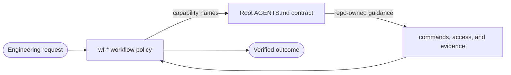
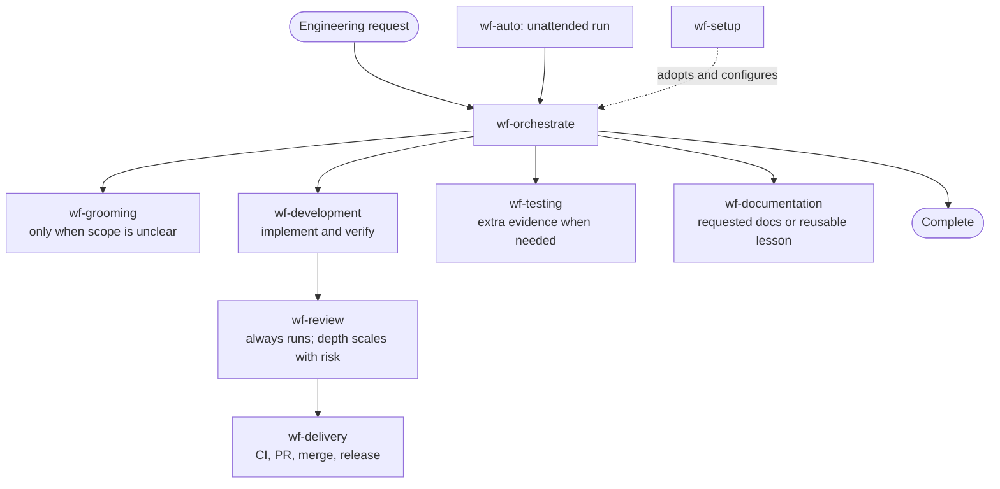
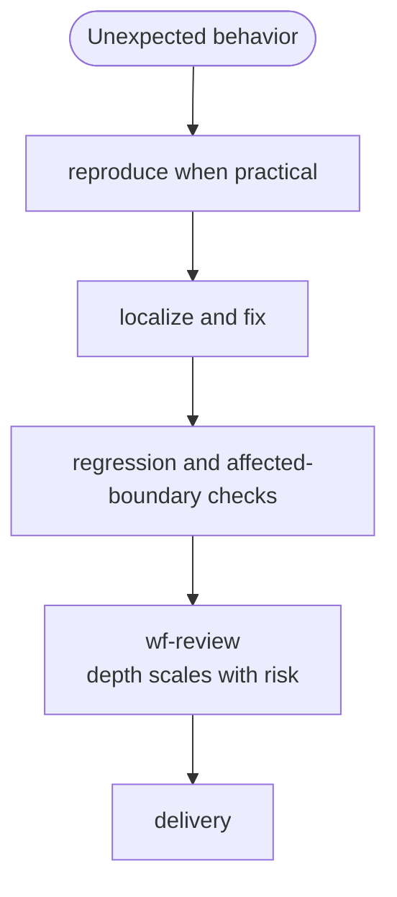
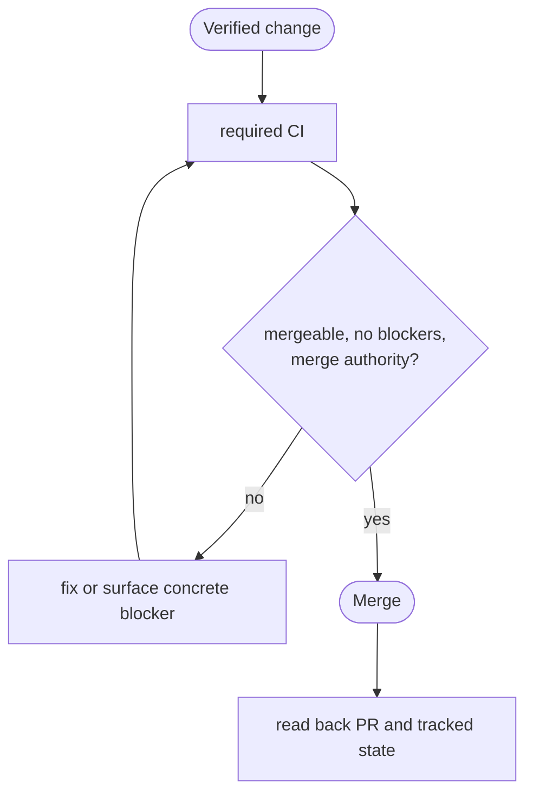
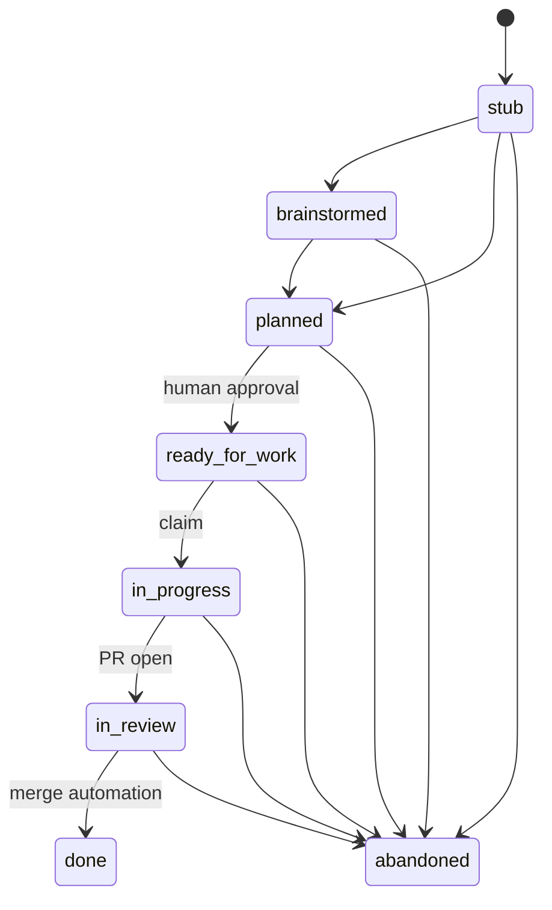

# Workflow flows

The nine public `wf-*` skills are a toolkit, not a mandatory pipeline, except
that `wf-review` always runs between development and delivery.

## Workflow and repository context

```mermaid
flowchart LR
    request([Engineering request]) --> WF["wf-* workflow policy"]
    WF -->|"capability names"| C["Root AGENTS.md contract"]
    C -->|"repo-owned guidance"| R["commands, access, and evidence"]
    R --> WF
    WF --> result([Verified outcome])
```

## Routing

```mermaid
flowchart TD
    req([Engineering request]) --> O["wf-orchestrate"]
    auto["wf-auto: unattended run"] --> O
    O --> G["wf-grooming<br/>only when scope is unclear"]
    O --> D["wf-development<br/>implement and verify"]
    D --> R["wf-review<br/>always runs; depth scales with risk"]
    O --> T["wf-testing<br/>extra evidence when needed"]
    R --> L["wf-delivery<br/>CI, PR, merge, release"]
    O --> K["wf-documentation<br/>requested docs or reusable lesson"]
    O --> done([Complete])
    S["wf-setup"] -. "adopts and configures" .-> O
```

Small, clear work still moves from development through `wf-review` before
delivery once required repository checks pass; review scales its depth to risk
rather than being skipped. Testing and documentation remain available when risk
or the request justifies them; they are not ceremonial stops.

## Bug flow

```mermaid
flowchart TD
    report([Unexpected behavior]) --> evidence["reproduce when practical"]
    evidence --> D["localize and fix"]
    D --> verify["regression and affected-boundary checks"]
    verify --> R["wf-review<br/>depth scales with risk"]
    R --> L["delivery"]
```

If reproduction is unavailable, record the uncertainty and prefer a diagnostic
or narrow evidence-backed change over a speculative broad fix.

## Delivery flow

```mermaid
flowchart TD
    change([Verified change]) --> ci["required CI"]
    ci --> ready{"mergeable, no blockers,<br/>merge authority?"}
    ready -->|no| fix["fix or surface concrete blocker"]
    fix --> ci
    ready -->|yes| merge([Merge])
    merge --> verify["read back PR and tracked state"]
```

`wf-review` always runs before delivery; an independent reviewer is added only
for high-risk, security-sensitive, or broad changes. Durable documentation is
added when there is an actual reusable lesson.

## Lifecycle state

In `github-project` mode, `scripts/lifecycle_board.py` owns board transitions.

```mermaid
stateDiagram-v2
    [*] --> stub
    stub --> brainstormed
    stub --> planned
    brainstormed --> planned
    planned --> ready_for_work: human approval
    ready_for_work --> in_progress: claim
    in_progress --> in_review: PR open
    in_review --> done: merge automation

    stub --> abandoned
    brainstormed --> abandoned
    planned --> abandoned
    ready_for_work --> abandoned
    in_progress --> abandoned
    in_review --> abandoned
```

`planned` means grooming is complete. A human moves the item to
`ready_for_work` before ordinary development may claim it. `wf-auto` is the
explicit unattended exception and records its forced approval transition.

See [WORKFLOW_SKILLS.md](WORKFLOW_SKILLS.md) for the layer model and the
[lifecycle reference](skills/wf-setup/references/lifecycle.md) for mechanics.
